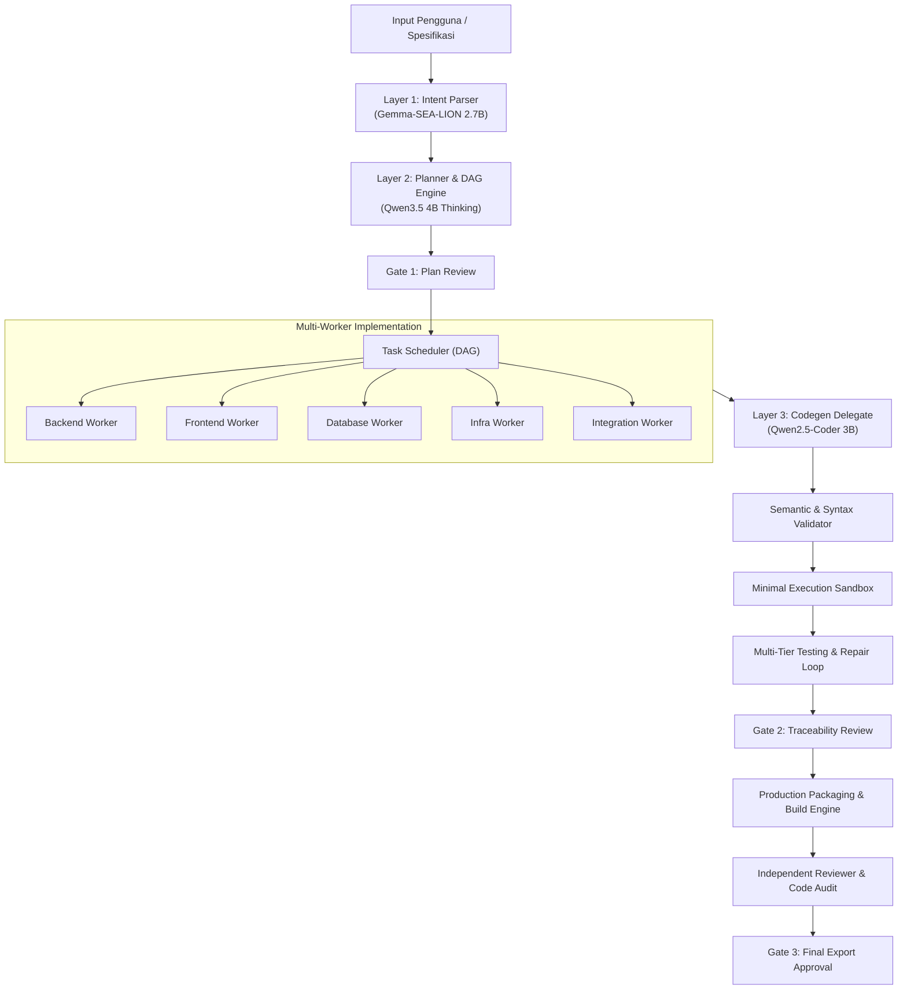

# 🚀 Dinggo — Specification-Driven AI Product Factory & Personal CLI IDE

**Dinggo** adalah AI Product Factory dan Personal CLI IDE lokal yang beroperasi **100% offline / self-hosted** dengan orkestrasi 3-Layer LLM via [Ollama](https://ollama.ai). Dinggo mengubah spesifikasi produk menjadi kode siap produksi melalui eksekusi multi-worker berbasis DAG, validasi semantik, pengujian otomatis berulang (*closed-loop self-repair*), isolasi keamanan (*execution sandboxing*), dan audit independen.

---

## 📑 Daftar Isi

- [Arsitektur Utama](#-arsitektur-utama)
- [Fitur Utama](#-fitur-utama)
  - [1. 3-Layer LLM Orchestration](#1-3-layer-llm-orchestration)
  - [2. 8-Phase Product Factory Lifecycle](#2-8-phase-product-factory-lifecycle)
  - [3. Partial-Safe Persistent State & Resume](#3-partial-safe-persistent-state--resume)
  - [4. Minimal Execution Sandboxing](#4-minimal-execution-sandboxing)
  - [5. Contextix Recovery Engine](#5-contextix-recovery-engine)
- [Instalasi & Persiapan](#-instalasi--persiapan)
- [Panduan Penggunaan (CLI Commands)](#-panduan-penggunaan-cli-commands)
- [Perintah Interaktif (Slash Commands)](#-perintah-interaktif-slash-commands)
- [Konfigurasi & Environment Variables](#-konfigurasi--environment-variables)
- [Struktur Proyek](#-struktur-proyek)
- [Pengujian & Benchmark](#-pengujian--benchmark)

---

## 🏛 Arsitektur Utama

Dinggo dirancang secara modular dan memisahkan tanggung jawab model AI ke dalam layer-layer spesifik:



---

## ✨ Fitur Utama

### 1. 3-Layer LLM Orchestration
- **Layer 1 (Intent Parser):** Memproses instruksi casual (Bahasa Indonesia & Inggris) menjadi payload JSON terstruktur menggunakan model *Gemma-SEA-LION-v4.5-E2B*.
- **Layer 2 (Planner):** Menyusun rencana aksi (*PlanSchema*) dan grafik ketergantungan task DAG (*TaskGraphSchema*) dengan *thinking-mode sanitization* dan verifikasi target file.
- **Layer 3 (Executor & Codegen Delegate):** Menghasilkan kode presisi dan dokumen teknis via *Qwen2.5-Coder-3b*, dilengkapi mekanisme *syntax validation* dan *safe rollback* jika terjadi kegagalan.
- **Memory Safe (`keep_alive: 0`):** Otomatis melakukan *eviction* model dari VRAM saat berpindah layer sehingga dapat berjalan lancar pada perangkat dengan RAM <16GB.

### 2. 8-Phase Product Factory Lifecycle
Dinggo memandu pengembangan perangkat lunak secara end-to-end melalui 8 tahap terstandarisasi:
1. **SPEC DISCOVERY:** Parsing & generator spesifikasi (`spec/product.md`, `spec/architecture.md`, `dinggo.yaml`).
2. **PLANNING DAG:** Penyusunan task graph berarah (*Directed Acyclic Graph*) antar modul.
3. **APPROVAL GATE 1:** Tinjauan dan konfirmasi rencana kerja oleh manusia.
4. **MULTI-WORKER IMPLEMENTATION:** Eksekusi tugas terisolasi berdasarkan domain (*Backend, Frontend, Database, Infra, Integration*).
5. **AUTOMATED TESTING & REPAIR:** Pengujian unit/sintaks otomatis dengan perbaikan tertutup (*closed-loop repair*).
6. **APPROVAL GATE 2:** Verifikasi keterlacakan kebutuhan (*traceability validation*).
7. **PRODUCTION BUILD:** Kompilasi dan pengemasan rilis aplikasi.
8. **INDEPENDENT REVIEW & GATE 3:** Audit kode otomatis (skor kuadran: Requirements, Quality, Security, Architecture) sebelum ekspor akhir.

### 3. Partial-Safe Persistent State & Resume
- State eksekusi dicatat secara persisten di `.dinggo/state.yaml`.
- **Partial-Safe:** Jika salah satu task gagal di tengah jalan, task-task yang telah sukses sebelumnya **tidak akan di-reset**.
- Saat me-resume eksekusi (`dinggo build` atau `dinggo interface`), scheduler otomatis melompati task yang telah selesai dan langsung melanjutkan task yang tertunda atau gagal.

### 4. Minimal Execution Sandboxing
Eksekusi pengujian otomatis dan perintah shell diamankan melalui `core.sandbox.runner.SandboxedRunner`:
- **Filesystem Jailing:** Mencegah path traversal (`../..`) dan membatasi operasi file hanya di dalam workspace direktori root.
- **Sanitasi Kredensial:** Otomatis membersihkan variabel lingkungan yang memuat token/kunci rahasia (`*_API_KEY`, `*_SECRET`, `*_TOKEN`, `AWS_*`, `AZURE_*`, `GITHUB_*`, dll.).
- **Pencegahan Perintah Berbahaya:** Memblokir perintah destruktif (seperti `rm -rf /`, `rmdir /s /q C:\`, format disk) dan memindai AST kode Python sebelum dieksekusi.
- **Timeout Containment:** Membatasi waktu maksimum eksekusi untuk mencegah infinite loop atau pemborosan sumber daya.

### 5. Contextix Recovery Engine
- Terintegrasi dengan memori proyek Contextix (`.context/`).
- Berperan spesifik sebagai **Recovery Synthesizer**: Saat task gagal dan perlu di-resume/repair, Contextix Adapter menyusun ringkasan *"state yang belum"* (task pending, diagnostik kegagalan, dan batasan aturan proyek yang relevan) langsung ke model codegen **tanpa perlu melakukan re-scan seluruh proyek dari nol**.

---

## 🛠 Instalasi & Persiapan

### Prasyarat
1. **Python 3.10+**
2. **[Ollama](https://ollama.ai)** terpasang dan berjalan di background (`ollama serve`).

### Download Model yang Direkomendasikan
```bash
ollama pull hf.co/aisingapore/Gemma-SEA-LION-v4.5-E2B-IT-GGUF:Q4_K_M
ollama pull qwen3.5:4b
ollama pull qwen2.5:3b
```

### Instalasi Repositori
```bash
# Clone atau masuk ke direktori proyek
cd "c:/AI System Project/dinggo"

# Buat virtual environment & install paket
python -m venv .venv
.venv\Scripts\activate      # Windows
# source .venv/bin/activate # Linux/macOS

pip install -e .
```

---

## 💻 Panduan Penggunaan (CLI Commands)

Dinggo menyediakan beragam mode eksekusi melalui CLI:

```bash
# 1. Masuk ke Interactive CLI IDE (Chat Mode)
dinggo

# 2. Buka TUI Product Factory Dashboard
dinggo interface

# 3. Jalankan Product Factory Wizard
dinggo wizard

# 4. Inisialisasi template spesifikasi default (spec/ & dinggo.yaml)
dinggo init

# 5. Buat dan lihat Task Graph DAG dari spec/
dinggo plan

# 6. Jalankan Full Product Factory Lifecycle (End-to-End Build)
dinggo build

# 7. Jalankan Automated Testing & Self-Repair Loop
dinggo test

# 8. Jalankan Audit Kode Independen & Review Dashboard
dinggo review

# 9. Cek status dan fase proyek saat ini
dinggo status
```

### Opsi Tambahan
- `--non-interactive` / `--ci` / `-y`: Menjalankan pipeline dalam mode non-interaktif (otomatis menyetujui gate).
- `--auto-approve`: Menyetujui semua konfirmasi approval gate secara otomatis.

---

## ⌨️ Perintah Interaktif (Slash Commands)

Saat berada di dalam mode chat interaktif (`dinggo`), Anda dapat menggunakan perintah slash berikut:

| Perintah | Deskripsi |
| :--- | :--- |
| `/help` | Menampilkan menu bantuan dan daftar perintah. |
| `/contextix [status\|generate]` | Menampilkan status memori Contextix atau memperbarui `.context/`. |
| `/config` | Menampilkan konfigurasi aktif dan URL Ollama. |
| `/models` | Menampilkan model yang terpasang di Ollama dan mapping per layer. |
| `/memory` | Menampilkan status *Short-Term Context* dan *Long-Term Code Graph*. |
| `/status` | Menampilkan status working directory, git branch, dan konektivitas Ollama. |
| `/compact` | Merangkum dan mengompres riwayat percakapan untuk menghemat token. |
| `/clear` | Membersihkan memori percakapan sesi aktif. |
| `/benchmark` | Menjalankan benchmark kecepatan layer & I/O file. |
| `/exit` atau `/quit` | Keluar dari sesi Dinggo. |

---

## ⚙️ Konfigurasi & Environment Variables

Konfigurasi dapat diatur melalui file `.env` di root direktori kerja:

```ini
# Koneksi Ollama
OLLAMA_BASE_URL=http://localhost:11434

# Pemilihan Model per Layer
MODEL_INTENT_PARSER=hf.co/aisingapore/Gemma-SEA-LION-v4.5-E2B-IT-GGUF:Q4_K_M
MODEL_PLANNER=qwen3.5:4b
MODEL_CODEGEN=qwen2.5:3b

# Manajemen Memori & Optimasi
FORCE_UNLOAD_BETWEEN_LAYERS=false
MAX_JSON_RETRY=3
OLLAMA_NUM_GPU=99
OLLAMA_NUM_THREAD=4
```

---

## 📂 Struktur Proyek

```text
dinggo/
├── cli/                        # Terminal UI, Interactive Shell, Gates & Views
│   ├── gates/                  # Approval Gates (Plan, Validation, Export)
│   ├── commands.py             # Slash Command Handler
│   ├── interface.py            # Main TUI Factory Menu
│   ├── main.py                 # CLI Entrypoint & Subcommands
│   ├── ui.py                   # Rich Console Rendering Engine
│   └── wizard.py               # Interactive Product Setup Wizard
│
├── core/                       # Core Orchestration & Business Logic
│   ├── builder/                # Release Packaging & Artifact Generator
│   ├── memory/                 # Short/Long-Term Memory & Contextix Adapter
│   ├── orchestrator/           # DAG Task Scheduler (Topological Order)
│   ├── planner/                # Layer 2 Planner & Task Graph Engine
│   ├── repair/                 # Automated Self-Repair Loop & Error Analyzer
│   ├── reviewer/               # Independent Review Engine & Scoped Audit Packages
│   ├── sandbox/                # Minimal Execution Sandboxing & Security Containment
│   ├── spec/                   # Spec Parser, Validator & Generator
│   ├── state/                  # Persistent State Machine (.dinggo/state.yaml)
│   ├── testing/                # Multi-Tier Test Runner
│   ├── validation/             # Requirement Traceability Matrix Validator
│   ├── workers/                # Domain-Specific Implementation Workers
│   ├── codegen.py              # Layer 3 Codegen Delegate Wrapper
│   ├── executor.py             # Plan Step Execution & Semantic Validation
│   ├── factory.py              # Product Factory Master Pipeline Orchestrator
│   ├── intent_parser.py        # Layer 1 Casual Intent Extractor
│   ├── ollama_client.py        # Ollama HTTP API Client
│   └── validator.py            # Syntax & AST Semantic Validator
│
├── spec/                       # Spesifikasi Produk, Arsitektur, dan Acceptance Criteria
├── tests/                      # Automated Unit & Integration Tests (108+ tests)
├── tools/                      # File Operations & Sandboxed Shell Runner
└── pyproject.toml              # Project Metadata & Dependencies
```

---

## 🧪 Pengujian & Benchmark

Menjalankan seluruh suite unit test:
```bash
.venv\Scripts\python -m unittest discover tests
```

Menjalankan pengujian performa dan latensi abstraksi:
```bash
.venv\Scripts\python run_benchmark.py
```

---

## 📄 Lisensi
Didistribusikan di bawah lisensi MIT.
