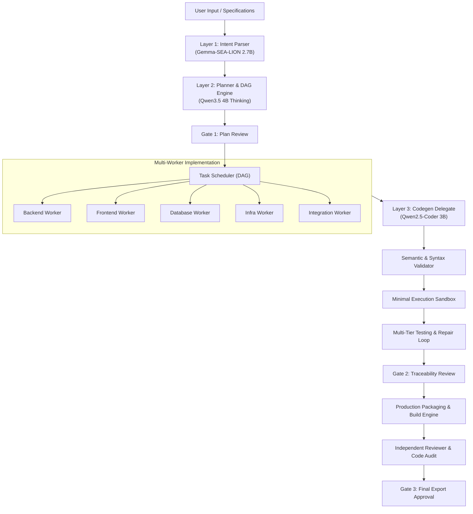

# 🚀 Dinggo — Specification-Driven AI Product Factory & Personal CLI IDE

**Dinggo** is a local, specification-driven AI Product Factory and Personal CLI IDE that operates **100% offline / self-hosted** with 3-layer LLM orchestration via [Ollama](https://ollama.ai). Dinggo transforms product specifications into production-ready software through DAG-based multi-worker execution, semantic validation, automated closed-loop self-repair testing, execution sandboxing, and independent code review audits.

---

## 📑 Table of Contents

- [Core Architecture](#-core-architecture)
- [Key Features](#-key-features)
  - [1. 3-Layer LLM Orchestration](#1-3-layer-llm-orchestration)
  - [2. 8-Phase Product Factory Lifecycle](#2-8-phase-product-factory-lifecycle)
  - [3. Partial-Safe Persistent State & Resume](#3-partial-safe-persistent-state--resume)
  - [4. Minimal Execution Sandboxing](#4-minimal-execution-sandboxing)
  - [5. Contextix Recovery Engine](#5-contextix-recovery-engine)
- [Installation & Setup](#-installation--setup)
- [Usage Guide (CLI Commands)](#-usage-guide-cli-commands)
- [Interactive Commands (Slash Commands)](#-interactive-commands-slash-commands)
- [Configuration & Environment Variables](#-configuration--environment-variables)
- [Project Structure](#-project-structure)
- [Testing & Benchmarks](#-testing--benchmarks)
- [License](#-license)

---

## 🏛 Core Architecture

Dinggo is architected modularly, isolating AI model responsibilities into distinct execution layers:



---

## ✨ Key Features

### 1. 3-Layer LLM Orchestration
- **Layer 1 (Intent Parser):** Parses casual user instructions into structured JSON schemas using *Gemma-SEA-LION-v4.5-E2B*.
- **Layer 2 (Planner):** Generates execution plans (*PlanSchema*) and dependency task graphs (*TaskGraphSchema*) with thinking-mode sanitization and target path validation.
- **Layer 3 (Executor & Codegen Delegate):** Generates precise code and technical documentation via *Qwen2.5-Coder-3b*, equipped with syntax validation and atomic rollback on failure.
- **Memory Safe (`keep_alive: 0`):** Automatically evicts models from VRAM when transitioning between layers, running smoothly even on machines with <16GB RAM.

### 2. 8-Phase Product Factory Lifecycle
Dinggo guides end-to-end software development through 8 standardized phases:
1. **SPEC DISCOVERY:** Specification parsing & generation (`spec/product.md`, `spec/architecture.md`, `dinggo.yaml`).
2. **PLANNING DAG:** Construction of a Directed Acyclic Graph (DAG) for modular task dependencies.
3. **APPROVAL GATE 1:** Human review and confirmation of the execution plan.
4. **MULTI-WORKER IMPLEMENTATION:** Isolated domain task execution (*Backend, Frontend, Database, Infra, Integration*).
5. **AUTOMATED TESTING & REPAIR:** Automated unit/syntax test suite execution with closed-loop self-repair.
6. **APPROVAL GATE 2:** Requirement traceability verification.
7. **PRODUCTION BUILD:** Compilation and release package bundling.
8. **INDEPENDENT REVIEW & GATE 3:** Automated 4-quadrant code audit (Requirements, Quality, Security, Architecture) prior to final release.

### 3. Partial-Safe Persistent State & Resume
- Execution state is persistently recorded in `.dinggo/state.yaml`.
- **Partial-Safe:** If a task fails mid-execution, previously completed tasks are **preserved without reset**.
- Resuming execution (`dinggo build` or `dinggo interface`) automatically skips completed tasks and continues directly from pending or failed tasks.

### 4. Minimal Execution Sandboxing
Automated test executions and shell commands are protected via `core.sandbox.runner.SandboxedRunner`:
- **Filesystem Jailing:** Prevents directory traversal (`../..`) and confines file operations strictly within the workspace root.
- **Credential Sanitization:** Strips environment variables containing secrets or access tokens (`*_API_KEY`, `*_SECRET`, `*_TOKEN`, `AWS_*`, `AZURE_*`, `GITHUB_*`, etc.).
- **Dangerous Command Blocking:** Blocks destructive commands (such as `rm -rf /`, `rmdir /s /q C:\`, disk formatting) and inspects Python AST syntax prior to execution.
- **Timeout Containment:** Limits maximum execution duration to prevent infinite loops or resource exhaustion.

### 5. Contextix Recovery Engine
- Integrates with Contextix project memory (`.context/`).
- Serves as a **Recovery Synthesizer**: When tasks fail and require resuming or repairing, the Contextix Adapter synthesizes a targeted summary of remaining state (pending tasks, failure diagnostics, and scoped project rules) directly into the codegen model **without requiring a full project re-scan from scratch**.

---

## 🛠 Installation & Setup

### Prerequisites
1. **Python 3.10+**
2. **[Ollama](https://ollama.ai)** installed and running in the background (`ollama serve`).

### Download Recommended Models
```bash
ollama pull hf.co/aisingapore/Gemma-SEA-LION-v4.5-E2B-IT-GGUF:Q4_K_M
ollama pull qwen3.5:4b
ollama pull qwen2.5:3b
```

### Repository Installation
```bash
# Clone or navigate to the project directory
cd "c:/AI System Project/dinggo"

# Create virtual environment & install package
python -m venv .venv
.venv\Scripts\activate      # Windows
# source .venv/bin/activate # Linux/macOS

pip install -e .
```

---

## 💻 Usage Guide (CLI Commands)

Dinggo provides various execution modes via CLI:

```bash
# 1. Launch Interactive CLI IDE (Chat Mode)
dinggo

# 2. Open TUI Product Factory Dashboard
dinggo interface

# 3. Run Product Factory Wizard
dinggo wizard

# 4. Initialize default specification templates (spec/ & dinggo.yaml)
dinggo init

# 5. Generate and view Task Graph DAG from spec/
dinggo plan

# 6. Run Full Product Factory Lifecycle (End-to-End Build)
dinggo build

# 7. Run Automated Testing & Self-Repair Loop
dinggo test

# 8. Run Independent Code Audit & Review Dashboard
dinggo review

# 9. Check active project phase and status
dinggo status
```

### Additional Flags
- `--non-interactive` / `--ci` / `-y`: Runs pipeline in non-interactive mode (auto-approves gates).
- `--auto-approve`: Automatically approves all confirmation gates.

---

## ⌨️ Interactive Commands (Slash Commands)

In interactive chat mode (`dinggo`), you can use the following slash commands:

| Command | Description |
| :--- | :--- |
| `/help` | Display help menu and list of commands. |
| `/contextix [status\|generate]` | Display Contextix memory status or regenerate `.context/`. |
| `/config` | Display active configuration parameters and Ollama URL. |
| `/models` | Display installed Ollama models and layer mappings. |
| `/memory` | Display *Short-Term Context* and *Long-Term Code Graph* status. |
| `/status` | Display working directory, git branch, and Ollama connectivity status. |
| `/compact` | Compact and summarize conversation history to conserve context window. |
| `/clear` | Clear active session conversation memory and terminal screen. |
| `/benchmark` | Run performance and file I/O speed benchmarks. |
| `/exit` or `/quit` | Exit the Dinggo session. |

---

## ⚙️ Configuration & Environment Variables

Configuration can be customized via `.env` in the working directory root:

```ini
# Ollama Connection
OLLAMA_BASE_URL=http://localhost:11434

# Model Selection per Layer
MODEL_INTENT_PARSER=hf.co/aisingapore/Gemma-SEA-LION-v4.5-E2B-IT-GGUF:Q4_K_M
MODEL_PLANNER=qwen3.5:4b
MODEL_CODEGEN=qwen2.5:3b

# Memory Management & Optimization
FORCE_UNLOAD_BETWEEN_LAYERS=false
MAX_JSON_RETRY=3
OLLAMA_NUM_GPU=99
OLLAMA_NUM_THREAD=4
```

---

## 📂 Project Structure

```text
dinggo/
├── cli/                        # Terminal UI, Interactive Shell, Gates & Views
│   ├── gates/                  # Approval Gates (Plan, Validation, Export)
│   ├── commands.py             # Slash Command Handler
│   ├── interface.py            # Main TUI Factory Menu
│   ├── main.py                 # CLI Entrypoint & Subcommands
│   ├── ui.py                   # Rich Console Rendering Engine
│   └── wizard.py               # Interactive Product Setup Wizard
│
├── core/                       # Core Orchestration & Business Logic
│   ├── builder/                # Release Packaging & Artifact Generator
│   ├── memory/                 # Short/Long-Term Memory & Contextix Adapter
│   ├── orchestrator/           # DAG Task Scheduler (Topological Order)
│   ├── planner/                # Layer 2 Planner & Task Graph Engine
│   ├── repair/                 # Automated Self-Repair Loop & Error Analyzer
│   ├── reviewer/               # Independent Review Engine & Scoped Audit Packages
│   ├── sandbox/                # Minimal Execution Sandboxing & Security Containment
│   ├── spec/                   # Spec Parser, Validator & Generator
│   ├── state/                  # Persistent State Machine (.dinggo/state.yaml)
│   ├── testing/                # Multi-Tier Test Runner
│   ├── validation/             # Requirement Traceability Matrix Validator
│   ├── workers/                # Domain-Specific Implementation Workers
│   ├── codegen.py              # Layer 3 Codegen Delegate Wrapper
│   ├── executor.py             # Plan Step Execution & Semantic Validation
│   ├── factory.py              # Product Factory Master Pipeline Orchestrator
│   ├── intent_parser.py        # Layer 1 Casual Intent Extractor
│   ├── ollama_client.py        # Ollama HTTP API Client
│   └── validator.py            # Syntax & AST Semantic Validator
│
├── spec/                       # Product Specifications, Architecture & Acceptance Criteria
├── tests/                      # Automated Unit & Integration Tests (111+ tests)
├── tools/                      # File Operations & Sandboxed Shell Runner
└── pyproject.toml              # Project Metadata & Dependencies
```

---

## 🧪 Testing & Benchmarks

Run the complete automated unit and integration test suite:
```bash
.venv\Scripts\python -m unittest discover tests
```

Run performance and abstraction latency benchmarks:
```bash
.venv\Scripts\python run_benchmark.py
```

---

## 📄 License
Distributed under the MIT License.
