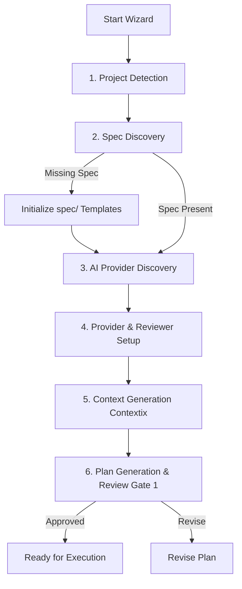

# RFC-005: Interactive CLI Interface & Initialization Wizard

## Status
**Proposed & Accepted**

## 1. Summary
RFC-005 defines the architecture for Dinggo's **Interactive Terminal User Interface (TUI)** and the multi-step **Product Factory Wizard**. It establishes:
1. The main interactive navigation menu (`dinggo interface` and `dinggo` root interactive entry point).
2. Resumable session detection & prompt (`RESUMABLE SESSION FOUND`).
3. Multi-step initialization & configuration Wizard:
   - Project & Spec Discovery.
   - AI Provider Discovery & Reviewer Selection.
   - Context Generation via Contextix.
   - Plan Preview & Approval Gate 1 trigger.
4. Settings Manager UI (Providers, Execution Policies, Reviewer Configuration).

---

## 2. Interactive Navigation Loop

The interactive CLI shell operates on a state-aware menu loop:

```text
╭──────────────────────────────────────────╮
│              DINGGO                      │
│         AI PRODUCT FACTORY               │
├──────────────────────────────────────────┤
│                                          │
│  > 1. Wizard                             │
│    2. Execute                            │
│    3. Settings                           │
│    4. Output                             │
│    5. Review                             │
│    6. Exit                               │
│                                          │
├──────────────────────────────────────────┤
│ Project: inventory-app                   │
│ Phase: IDLE / PLANNING / REVIEW          │
│ Status: READY                            │
╰──────────────────────────────────────────╯
```

### Menu Options
1. **Wizard**: Guided step-by-step pipeline from zero to approved plan.
2. **Execute**: Launch / resume task graph execution, automated testing, repair, and validation.
3. **Settings**: Configure AI models, auto-repair cycles, approval modes, and provider preferences.
4. **Output**: View build history, artifacts in `dist/`, logs, and documentation.
5. **Review**: Trigger independent reviewer (Codex/Claude/Ollama) and view findings.
6. **Exit**: Gracefully exit while preserving session state in `.dinggo/state.yaml`.

---

## 3. Wizard Workflow Specification (`cli/wizard.py`)

The Wizard guides the developer through the preparation phase:



### Wizard Steps:
1. **Project Detection**: Scans Git, manifests (`package.json`, `pyproject.toml`), and language/framework types.
2. **Specification Discovery**: If `spec/` is missing, prompts developer with one-click template initialization.
3. **Provider Discovery**: Identifies available CLI tools (`codex`, `claude`, `gemini`) and local Ollama models.
4. **Provider Setup**: Confirms default reviewer and primary coding models.
5. **Context Generation**: Executes Contextix intelligence indexing on documentation and repository structure.
6. **Plan Generation**: Invokes Layer 2 Planner with parsed `ProductSpec` to construct the execution DAG.

---

## 4. Resumable Session Handler

On startup, if `.dinggo/state.yaml` indicates an incomplete session (`can_resume = True`), Dinggo immediately renders:

```text
╭──────────────────────────────────────────╮
│        RESUMABLE SESSION FOUND           │
├──────────────────────────────────────────┤
│ Project:    inventory-app                │
│ Last Phase: REVIEW_REPAIR (Cycle 2/3)    │
│ Active Task: TASK-047                    │
│                                          │
│ [1] Resume session                       │
│ [2] Restart from beginning               │
│ [3] View current state                   │
╰──────────────────────────────────────────╯
```

---

## 5. Module Architecture

- `cli/interface.py`: Main interactive loop, menu dispatching, and header status box.
- `cli/wizard.py`: Multi-step guided wizard implementation.
- `cli/settings_view.py`: Interactive settings configuration for providers, execution, and review.
- `cli/ui.py`: UI primitives (menu selections, cards, badges, status lines, spinners).
