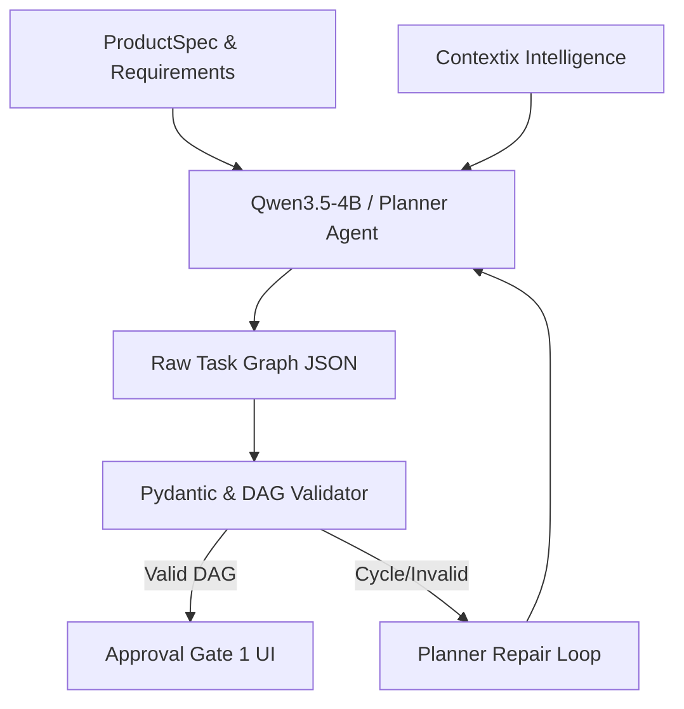

# RFC-006: Spec-Driven Task Graph Planner & Approval Gate 1

## Status
**Proposed & Accepted**

## 1. Summary
RFC-006 defines the architecture for Dinggo's **Spec-Driven Task Graph Planner** and **Approval Gate 1 (Plan Review)**.
It upgrades Layer 2 from generating flat sequential step lists into constructing a **Directed Acyclic Graph (DAG)** of tasks linked to traceable Requirement IDs (`AUTH-001`, `INV-001`).

---

## 2. Task Graph Schema & Data Models (`core/planner/task_graph.py`)

A task is a unit of work assigned to a specialized worker. A plan is a directed acyclic graph of tasks.

```text
Requirement: INV-001
   │
   ├── TASK-002: Implement inventory database schema (Worker: database)
   │      └── depends_on: [TASK-001]
   │
   └── TASK-005: Implement inventory CRUD service (Worker: backend)
          └── depends_on: [TASK-002]
```

### Pydantic TaskNode Model
```python
class TaskNode(BaseModel):
    id: str = Field(description="Unique Task ID, e.g. TASK-001")
    title: str = Field(description="Short human-readable summary")
    description: str = Field(description="Detailed execution prompt")
    requirement_id: Optional[str] = Field(default=None, description="Linked Requirement ID (e.g. INV-001)")
    worker_type: Literal["backend", "frontend", "database", "infra", "integration", "general"] = "backend"
    target_files: List[str] = Field(default_factory=list, description="Target files created or modified")
    depends_on: List[str] = Field(default_factory=list, description="IDs of tasks that must complete before this task")
    test_ids: List[str] = Field(default_factory=list, description="Associated test identifiers")
    status: Literal["pending", "in_progress", "completed", "failed", "skipped"] = "pending"

class TaskGraphSchema(BaseModel):
    project_name: str
    architecture: str
    database: str
    requirements_coverage: Dict[str, List[str]] = Field(default_factory=dict, description="Map of Req ID -> Task IDs")
    tasks: List[TaskNode] = Field(default_factory=list)
```

### Graph Operations
- **Topological Sorting**: Resolves task execution order guaranteeing dependencies are satisfied.
- **Cycle Detection**: Validates that the graph contains zero circular dependencies.
- **Coverage Validation**: Verifies that every critical requirement in `ProductSpec` is mapped to at least one task.

---

## 3. Spec-Driven Plan Generation (`core/planner.py`)

The Planner transforms `ProductSpec` + Contextix knowledge into a `TaskGraphSchema`:



---

## 4. Approval Gate 1 Specification (`cli/gates/plan_review.py`)

Before any implementation work begins, Dinggo renders the plan review gate:

```text
╭──────────────────────────────────────────╮
│         DINGGO PLAN REVIEW (GATE 1)      │
├──────────────────────────────────────────┤
│ Project:      Inventory Management       │
│ Requirements: 27/27 covered              │
│ Tasks:        45 tasks in 14 DAG tiers   │
│ Architecture: Next.js + FastAPI          │
│ Database:     PostgreSQL                 │
│                                          │
│ [1] Approve Plan & Begin Execution       │
│ [2] Revise Plan with Feedback            │
│ [3] Cancel                               │
╰──────────────────────────────────────────╯
```

---

## 5. Verification & Test Strategy
- Unit tests verifying topological sort on complex DAGs.
- Unit tests detecting circular dependency errors and triggering DAG validation failures.
- Unit tests ensuring Requirement IDs from `spec/` are preserved in task nodes.
- Approval Gate 1 interactive and headless test assertions.
